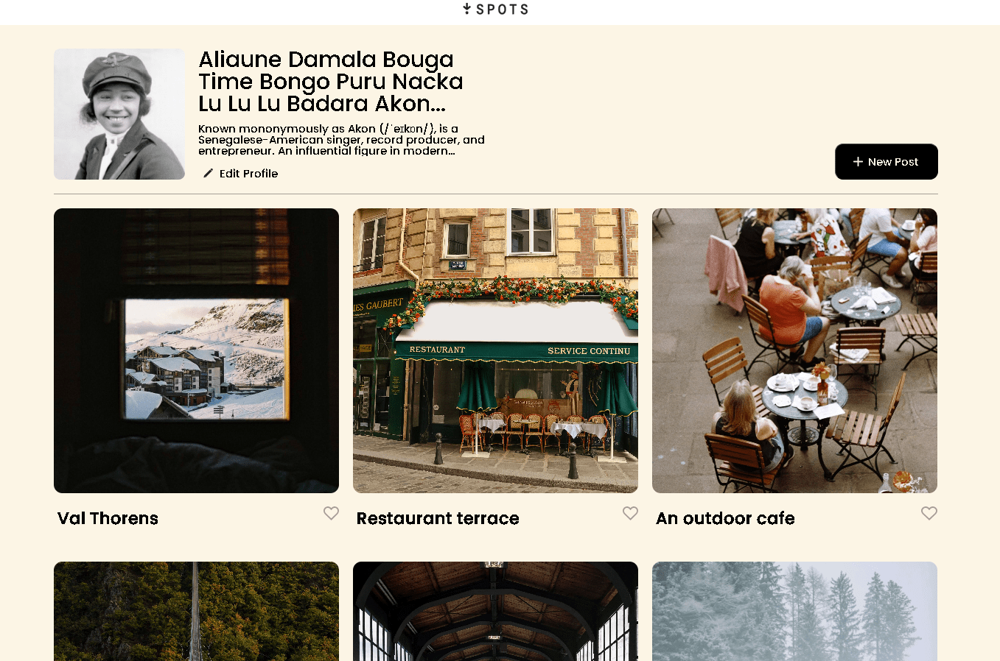
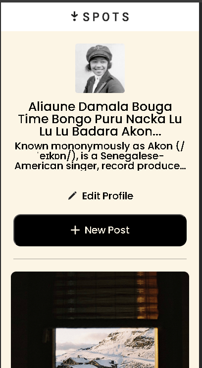

# Project Spots

## Description

Making a new image sharing site from sratch and getting it as close to or exact to the orignal, as to the pre-fab templates it uses from Figma.

### Tech Stack

- HTML
- CSS
- Figma
- Responsive Design

# Figma

Link to the project on Figma (https://www.figma.com/file/BBNm2bC3lj8QQMHlnqRsga/Sprint-3-Project-%E2%80%94-Spots?type=design&node-id=2%3A60&mode=design&t=afgNFybdorZO6cQo-1)

# Images

All images can be located in the zip file attched
[text](images.zip) here.

## Deployment

This webpage is deployed to GitHub Pages

- [Deployment Link](https://ogarcia96.github.io/se_project_spot)
